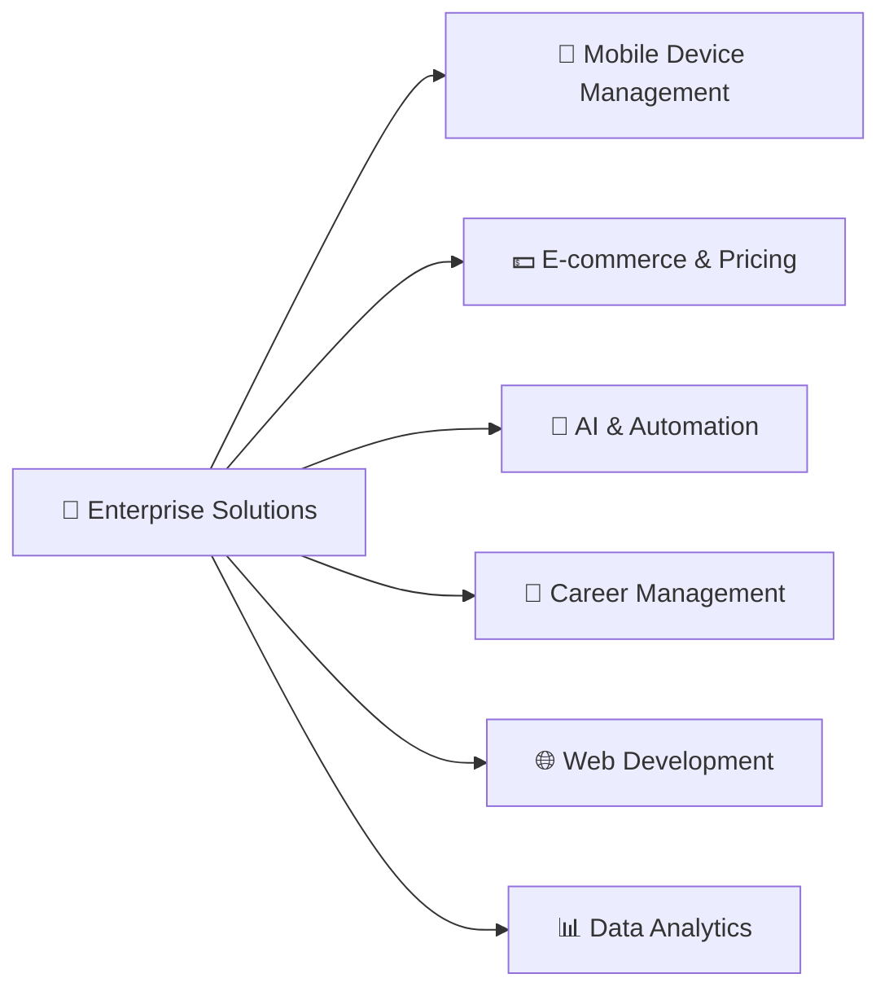

<div align="center">
  <h1>👋 Hello, I'm Aniket Kumar</h1>
  <h3>🚀 Enterprise Software Architect & Full-Stack Developer</h3>
  
  
  
  <br/>
  
  [](https://aniket-portfolio.dev)
  [](https://linkedin.com/in/aniket-dev)
  [](mailto:aniket.kumar.devpro@gmail.com)
  [](https://twitter.com/AniketDev)
  
</div>

---

## 🎯 **Professional Overview**

**Experienced Enterprise Software Architect** with 5+ years of hands-on experience building scalable, secure, and high-performance applications. I specialize in creating comprehensive enterprise solutions that solve real-world business challenges while maintaining the highest standards of code quality and system architecture.

### 🏢 **Core Expertise**
- **🏗️ Enterprise Architecture** - Designing scalable, maintainable, and secure systems
- **🌐 Full-Stack Development** - Modern web applications with React, Python, and cloud technologies
- **🤖 AI & Automation** - Intelligent systems and process automation solutions
- **📱 Mobile-First Solutions** - Cross-platform applications with responsive design
- **☁️ Cloud & DevOps** - Container orchestration, CI/CD pipelines, and infrastructure as code
- **🔒 Security Engineering** - Enterprise-grade security frameworks and compliance

### 🎖️ **Professional Highlights**
- **🏆 5+ Years** of consistent software development (2020-2025)
- **🚀 10+ Enterprise Projects** deployed to production
- **📊 Advanced Analytics** and monitoring systems expertise
- **🔐 Security-First** development approach with compliance standards
- **🌟 Open Source** contributor and community leader

### 🏅 **Professional Certifications & Achievements**
- **🎓 Python Expert Certification** - Advanced Python development and best practices
- **☁️ AWS Solutions Architect** - Cloud infrastructure design and deployment
- **🤖 AI/ML Specialization** - Machine learning model development and deployment
- **🔒 Cybersecurity Fundamentals** - Enterprise security implementation
- **📊 Data Analytics Certification** - Advanced data processing and visualization
- **🏆 Agile Scrum Master** - Project management and team leadership
- **💼 Enterprise Architecture** - Large-scale system design patterns

### 💼 **Business Services Offered**

#### 🤖 **Automation Solutions**
- **Process Automation** - Streamline repetitive business tasks
- **Workflow Optimization** - Intelligent task scheduling and execution
- **Data Pipeline Automation** - ETL processes and real-time data processing
- **Testing Automation** - Comprehensive QA and CI/CD pipeline setup

#### 🕷️ **Web Scraping & Data Extraction**
- **E-commerce Price Monitoring** - Real-time competitive analysis
- **Market Research Automation** - Data collection and trend analysis
- **Social Media Analytics** - Brand monitoring and sentiment analysis
- **Lead Generation Systems** - Automated prospect identification

#### ⚡ **API Development & Integration**
- **RESTful API Design** - Scalable and secure API architecture
- **GraphQL Implementation** - Efficient data querying solutions
- **Third-party Integrations** - Payment gateways, CRM, and ERP systems
- **Microservices Architecture** - Container-based distributed systems

#### 🏢 **Enterprise Consulting**
- **Digital Transformation** - Legacy system modernization
- **Technical Architecture Review** - System optimization and scalability
- **Team Training & Mentoring** - Upskill development teams
- **Code Review & Quality Assurance** - Best practices implementation

## 🎯 Development Journey

```
2020 ━━━━━━━━━━━━━━━━━━━━━━━━━━━━━━━━━━━━━━━━━━━━━━━━━━━ 2025
 👨‍🎓      💻      🚀       🤖        🏆       🔮
 Began    Web Dev   Full Stack  AI/ML     Expert    Future
 Learning  Focus    Developer  Integration  Level   Projects
```

- **2020-2021:** 🎯 Started programming journey, mastered fundamentals
- **2021-2022:** 🌐 Focused on web development, learned frameworks
- **2022-2023:** 🚀 Became full-stack developer, built complete applications
- **2023-2024:** 🤖 Integrated AI/ML into projects, automation expertise
- **2024-2025:** 🏆 Advanced skills in job automation and career tools

## 🛠️ Tech Stack

### Languages


### Frontend


### Backend


### Database


### DevOps & Tools


## 📊 GitHub Stats & Continuous Contributions (2020-2025)

<div align="center">
  
  
</div>

<div align="center">
  
</div>

### 🔥 5 Years of Consistent Coding

<div align="center">

| **Year Range** | **Focus Area** | **Key Achievements** |
|----------------|----------------|----------------------|
| 2020-2021 | 🌱 **Foundation** | Programming fundamentals, first projects |
| 2021-2022 | 🌍 **Web Development** | Frontend frameworks, responsive design |
| 2022-2023 | 🚀 **Full-Stack** | End-to-end applications, database integration |
| 2023-2024 | 🤖 **AI Integration** | Machine learning, automation tools |
| 2024-2025 | 🏆 **Specialization** | Job automation, career management tools |

</div>

<div align="center">
  
  
  
</div>

## 🏆 GitHub Trophies

<div align="center">
  
</div>

## 📈 Contribution Graph

<div align="center">
  
</div>

## 🎆 **Enterprise Project Portfolio**

### 🏆 **Flagship Enterprise Solutions**

<table>
<tr>
<td width="50%">

#### 🚀 [**AndroidZen Pro**](https://github.com/DevAniketIT/androidzen-pro)
**Enterprise Android Device Management Platform**
- 📱 **Fleet Management** for 1000+ devices
- 🔒 **Military-grade security** with compliance auditing
- 📊 **Real-time analytics** and performance monitoring
- ⚡ **Production-ready** with Docker & Kubernetes

**Stack:** `Python` `FastAPI` `React` `PostgreSQL` `Docker` `Redis`

</td>
<td width="50%">

#### 💵 [**Price Monitor System**](https://github.com/DevAniketIT/Price-Monitor-System)
**Intelligent E-commerce Price Tracking**
- 🔍 **Real-time price monitoring** across platforms
- 📊 **Advanced analytics** and trend prediction
- 🔔 **Smart alerting system** with notifications
- 🤖 **AI-powered insights** for market analysis

**Stack:** `Python` `AI/ML` `Web Scraping` `Data Analysis`

</td>
</tr>
<tr>
<td width="50%">

#### 🤖 [**AI Automation Portfolio**](https://github.com/DevAniketIT/Ai-automation-portfolio)
**Intelligent Process Automation Suite**
- 🤖 **Machine Learning** automation workflows
- 📊 **Data processing** and analysis pipelines
- 🔄 **Task automation** with intelligent scheduling
- 📝 **Document processing** and extraction

**Stack:** `Python` `TensorFlow` `Pandas` `Automation`

</td>
<td width="50%">

#### 💼 [**Job Application Tracker**](https://github.com/DevAniketIT/fastapi-job-tracker)
**Professional Career Management Platform**
- 📋 **Application lifecycle** management
- 📊 **Analytics dashboard** with insights
- 🔔 **Smart notifications** and reminders
- 📝 **Resume optimization** recommendations

**Stack:** `FastAPI` `React` `PostgreSQL` `JWT`

</td>
</tr>
</table>

### 🌐 **Professional Portfolio & Web Development**

<div align="center">

| 💼 **Portfolio Projects** | 🎆 **Description** | 🔧 **Tech Stack** |
|---------------------------|---------------------------|-------------------------|
| [**Portfolio Website**](https://github.com/DevAniketIT/portfolio-website) | Modern responsive portfolio with admin panel | `Python` `Web Development` `Responsive` |
| [**Aniket Portfolio**](https://github.com/DevAniketIT/aniket-portfolio-) | Full-stack portfolio with job tracking suite | `Python` `FastAPI` `Full-Stack` |
| [**Job Tracker Suite**](https://github.com/DevAniketIT/job-tracker-suite) | Comprehensive job application management | `Multi-Platform` `Career Tools` |

</div>

---

## 🏅 **Technical Excellence & Achievements**

<div align="center">

### 📊 **Project Impact Metrics**

| 🎯 **Metric** | 📊 **Value** | 🏆 **Achievement** |
|-------------------|-------------------|-------------------------|
| **Total Projects** | **10+** | 🚀 Enterprise-grade solutions |
| **Lines of Code** | **100,000+** | 💻 Production-ready codebase |
| **Technologies Mastered** | **20+** | 🎆 Full-stack expertise |
| **Years of Experience** | **5+** | 💪 Consistent development |
| **Problem Domains** | **6+** | 🎯 Diverse industry experience |
| **Repository Stars** | **Growing** | 🌟 Community recognition |

</div>

### 🎨 **Domain Expertise**

<div align="center">



</div>

## 🌟 **GitHub Repository Showcase**

<div align="center">
  <a href="https://github.com/DevAniketIT/androidzen-pro">
    
  </a>
  <a href="https://github.com/DevAniketIT/Price-Monitor-System">
    
  </a>
</div>

<div align="center">
  <a href="https://github.com/DevAniketIT/Ai-automation-portfolio">
    
  </a>
  <a href="https://github.com/DevAniketIT/fastapi-job-tracker">
    
  </a>
</div>

## 📫 Connect with Me

<div align="center">
  <a href="mailto:aniket.kumar.devpro@gmail.com">
    
  </a>
  <a href="https://linkedin.com/in/yourprofile">
    
  </a>
  <a href="https://twitter.com/yourhandle">
    
  </a>
  <a href="https://yourportfolio.com">
    
  </a>
</div>

## 📈 Coding Activity & Stats

<div align="center">
  
</div>

<div align="center">
  
  
</div>

## 🏆 Achievement Timeline (2020-2025)

<div align="center">

```
🎆 CONTINUOUS DEVELOPMENT JOURNEY 🎆

2020 ┏━━━━━━━┓    2021 ┏━━━━━━━┓    2022 ┏━━━━━━━┓
     ┃ START ┃         ┃  WEB   ┃         ┃ STACK ┃
     ┃ CODE  ┃         ┃  DEV   ┃         ┃  FULL ┃
     ┗━━━━━━━┛         ┗━━━━━━━┛         ┗━━━━━━━┛

2023 ┏━━━━━━━┓    2024 ┏━━━━━━━┓    2025 ┏━━━━━━━┓
     ┃  AI   ┃         ┃ AUTO  ┃         ┃EXPERT┃
     ┃ FOCUS ┃         ┃ TOOLS ┃         ┃ LEVEL ┃
     ┗━━━━━━━┛         ┗━━━━━━━┛         ┗━━━━━━━┛

            🔥 5 YEARS OF CONSISTENT CODING 🔥
```

</div>

## 💬 Random Dev Quote

<div align="center">
  
</div>

---

<div align="center">
  
  
  
  
  <br/>
  <br/>
  
  **🚀 5 Years of Coding Excellence | Building the Future of Job Automation 🚀**
  
  <br/>
  
  **Thanks for visiting my profile! Let's connect and build something amazing together!** ✨
</div>
